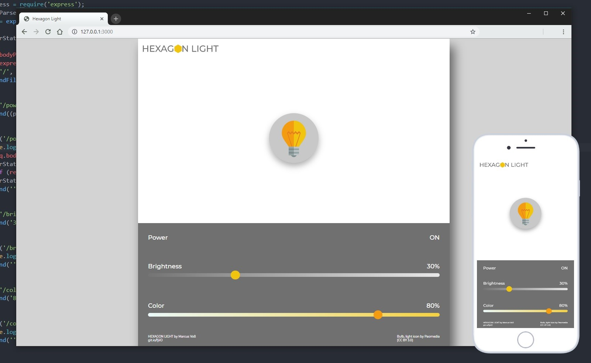
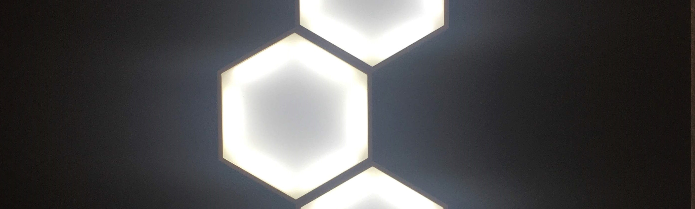

# 

3D printed  hexagonal smartlights running on an ESP32 microcontroller with arduino core (Thingverse link for 3d print files )

## required libraries:
- The web Ui is stored on the SPIFFS so the <a href="https://github.com/me-no-dev/arduino-esp32fs-plugin">ESP32 filesystem uploader plugin<a/> is required
- I'm using the <a href="https://github.com/fhessel/esp32_https_server">ESP32 https server library<a/> (but currently the webui runs on normal http)

## Installation

- upload the web UI files to the ESP32 filesystem
- enter your wifi SSID and password inside the config.h
- (optional) change the pin definitions in config.h
- upload the sketch to the esp32
- have fun!

>responsive web UI:  currently without any live synchronization when the web UI is opend on multiple devices at the same time (GET requests are kept to a minimum to not overwhelm the ESP)

## License

