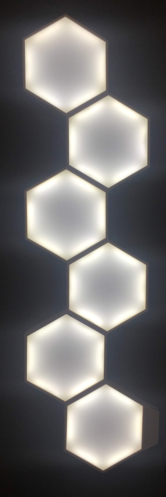

# 

3D printed  hexagonal smartlights running on an ESP32 microcontroller with arduino core

## Photos

>More photos can be found on my <a href ="https://www.thingiverse.com/thing:3785919">thingverse page<a/>

## Responsive Web UI

>Currently the web UI does not include any kind of live synchronization. So when the Ui is open on multiple devices at the same time, you have to manually reload the page to see any changes. This is as to no0t overwhelm the microcontroller)

## Assembly

>The 3D-printable files can be found on <a href="https://www.thingiverse.com/thing:3785919">thingverse<a/>

## Installation
- upload the web UI files to the ESP32 filesystem
- enter your wifi SSID and password inside the config.h
- (optional) change the pin definitions in config.h
- upload the sketch to the esp32
- have fun!

## Required Hardware
- Access to a 3D printer for the frame ( i suggest using something temperature resistant like petg)
- Dual color LED strip
- ESP32 microcontroller
- Some basic electronics to power the ESP and drive the LED strip.

## required libraries:
- The web Ui is stored on the SPIFFS so the <a href="https://github.com/me-no-dev/arduino-esp32fs-plugin">ESP32 filesystem uploader plugin<a/> is required
- I'm using the <a href="https://github.com/fhessel/esp32_https_server">ESP32 https server library<a/> (but currently the webui runs on normal http)

## License

Lightbulb icon by <a href="http://www.iconarchive.com/show/small-n-flat-icons-by-paomedia/light-bulb-icon.html">Paomedia<a/> (CC0)
